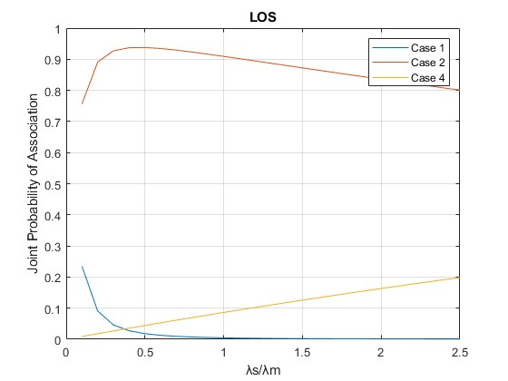

# Spectral efficiency simulation for NTU CSIE5113 final project
<a href="https://example.com](https://docs.google.com/presentation/d/15V1ZMnxzy2kArASVFP3DmEJ7KOpT7ato76mGtZuGKJM/edit?usp=sharing">presentation</a>

